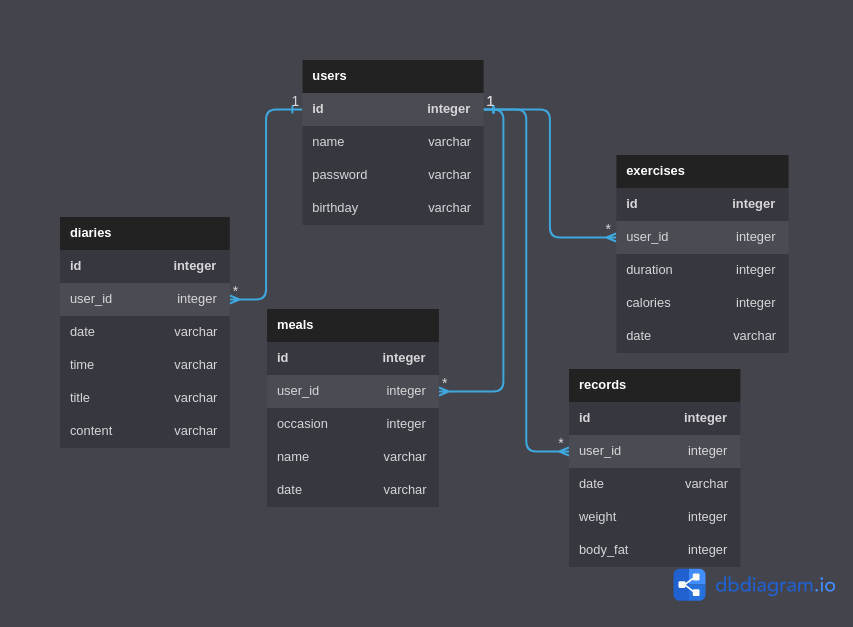

# Simple Health App

## System Overview

### Requirements Breakdown

- Time: 12-16 hours
- No Authentication and Authorization of Users
- No unit tests
- In-memory database with mockup data
- 5 Endpoints: Users, Meals, Records, Exercises, Diaries
- Each endpoint only needs Create, Read One, and Read All actions
- But due to time limit only the User endpoints will be implemented
- Static Landing Page (About)
- Input Page (Register)
- Home Page display all registered users

### Business Decisions

- Single Rest API with Mutex and Caching, without external libraries; exposes multiple endpoints
- Simple backend database layer to communicate with external database
- Simple SPA frontend with routings consume the backend's endpoints and render them appropriately according to the Figma designs
- All functionalities and endpoints should be tested

### Technical Decisions

- Dev Env: Go, Node
- Database: In-memory
- Communication: HTTP1.1 (REST Endpoints)
- Backend: Go
- Frontend: React

### Local Demo Instruction

- Install `Go` and `NodeJS`, also `jq` to prettify JSON outputs
- Create an optimized build of the React client for Go server to serve:

```bash
cd client && npm run build
```

- Build into one single binary and run the Go server, which will serve both backend and frontend:

```bash
cd .. && go build -o app
```

```bash
./app
```

- Go to `<http://localhost:4200>' to visit the website
- Go to CURL Endpoints Documentation to test the backend endpoints

### Development Environment

- Install Go and Node
- Live editing React client by first go to the `client` directory and run `npm start` for hot reload, then go to `http://localhost:3000`
- After make changes to the React client, go to the `client` directory and run `npm run build` to rebuild the client
- Run Go server as normal, `go run .`

## Design Documents

### Business Logics

#### Users

- When creating User, will check if the name already existed
- There currently no Auth for User endpoints
- There currently no password encoding

### Database Schemas



### CURL Endpoints Documentation

#### User

- Read All Users:

```bash
curl localhost:8080/users | jq
```

- Read a User given their `ID`:

```bash
curl localhost:8080/users/<ID> | jq
```

- Create a new User:

```bash
curl --request POST \
--header 'content-type:application/json' \
--data '{
    "name": "Admin 2",
    "password": "password",
    "birthday": "1990-01-01",
    "meals": [],
    "records": [],
    "exercises": [],
    "diary": []
  }' \
localhost:8080/users | jq
```
